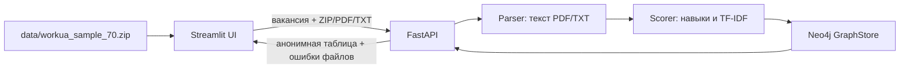
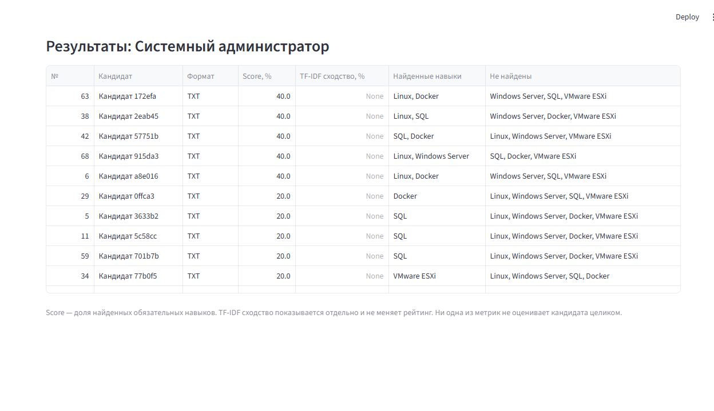

# AI-система для скоринга кандидатов

Локальное MVP для пакетного разбора резюме и сопоставления найденных навыков с требованиями вакансии. Проект загружает обезличенный тестовый набор Work.ua из 70 записей, принимает дополнительные PDF/TXT/ZIP, рассчитывает покрытие навыков, показывает результаты в Streamlit и сохраняет структуру и результаты в Neo4j.

> **Ограничение:** Score показывает только долю совпавших обязательных навыков. Он не оценивает кандидата целиком и не должен автоматически определять решение о найме. Парсер и словарь навыков используют эвристики; сканированные PDF без текстового слоя не поддерживаются, OCR нет.

## Содержание

- [Возможности](#возможности)
- [Как устроена обработка](#как-устроена-обработка)
- [Формулы и ограничения скоринга](#формулы-и-ограничения-скоринга)
- [Структура репозитория](#структура-репозитория)
- [Требования](#требования)
- [Запуск в Windows и PyCharm](#запуск-в-windows-и-pycharm)
- [Проверка приложения](#проверка-приложения)
- [HTTP API](#http-api)
- [Данные и приватность](#данные-и-приватность)
- [Настройка и устранение неполадок](#настройка-и-устранение-неполадок)
- [Результаты работы сайта](#результаты-работы-сайта)
- [Лицензии](#лицензии)

## Возможности

- Веб-интерфейс на Streamlit: `http://127.0.0.1:8501`.
- REST API на FastAPI: `http://127.0.0.1:8000`; интерактивная схема API доступна по `/docs`.
- Готовая вакансия системного администратора и архив `data/workua_sample_70.zip` автоматически отправляются на расчёт. Для первого пакетного запуска вручную выбирать файлы не надо.
- Можно добавить собственную вакансию, обязательные навыки и описание, а также дополнительные резюме.
- Входные форматы: текстовые PDF, TXT и ZIP с PDF/TXT. Архив читается в памяти, файлы на диск не распаковываются.
- Результаты содержат анонимную метку кандидата, Score, отдельную TF-IDF-метрику, найденные и отсутствующие обязательные навыки.
- Neo4j хранит вакансии, нормализованные навыки и результаты расчёта.

## Как устроена обработка



При нажатии **«Рассчитать рейтинг»** интерфейс берёт встроенный архив из `data/`, формирует multipart-запрос к `POST /score` и добавляет выбранную вакансию. API раскрывает ZIP в памяти, независимо разбирает поддерживаемые резюме, извлекает навыки из каталога требований, рассчитывает показатели и пишет графовые связи в Neo4j. Ошибки отдельных неподдерживаемых/повреждённых документов возвращаются отдельно, остальные корректные резюме продолжают обрабатываться.

### Score и TF-IDF — разные показатели

- **Score, %** — покрытие обязательных навыков: `число найденных обязательных навыков / число всех обязательных навыков × 100`. Это основной балл в таблице.
- **TF-IDF сходство, %** — косинусное сходство текста профессионального опыта и описания вакансии. Оно рассчитывается отдельно и **не меняет Score**. Если описание вакансии пустое или профессиональный текст не извлечён, значение равно `null` и отображается пустым.
- Совпадения ищутся по явно заданным названиям и ограниченному списку алиасов (например, `Postgres` → `PostgreSQL`, `K8s` → `Kubernetes`). Некоторые простые отрицательные формулировки вроде «без опыта Docker» исключают упоминание. Сложный контекст и фактический уровень навыка система не понимает.
- В приложении нет LLM-оценки и нет автоматического решения о найме.

### Данные в Neo4j

Используются узлы `Vacancy`, `Candidate`, `Resume`, `Skill` и связи `REQUIRES`, `HAS_RESUME`, `HAS_SKILL`, `SCORED_FOR`. В `SCORED_FOR` сохраняются Score, найденные/отсутствующие навыки, дополнительное TF-IDF сходство и время расчёта. Уникальные ограничения создаются при старте API. Docker volume `neo4j_data` сохраняет базу при остановке контейнера.

## Структура репозитория

| Путь | Назначение |
|---|---|
| `api/main.py` | FastAPI-приложение, проверки входных данных, ограничения загрузки, раскрытие ZIP, обработка каждого файла, вызовы парсера/скорера и запись результата. |
| `Parser/resume_parser.py` | Чтение TXT (UTF-8/UTF-8 с BOM, затем CP1251) и текстовых PDF через `pypdf`; очистка текста, извлечение имени при наличии и профессионального текста, поиск навыков. OCR не выполняется. |
| `scorer/skill_matching.py` | Нормализация названий/алиасов навыков и эвристическое исключение простых отрицаний. |
| `scorer/benchmark.py` | Функция покрытия обязательных навыков `analyze_skills` и автономная проверка демо-набора. |
| `scorer/text_similarity.py` | Отдельное TF-IDF косинусное сходство текста резюме и вакансии. |
| `scorer/defaults.py` | Название демо-вакансии, обязательные навыки, описание и имя встроенного архива. |
| `db/graph_store.py` | Neo4j-драйвер, ограничения, запись/чтение вакансий и результатов. |
| `ui/app.py` | Streamlit-форма, автоматическая отправка встроенного ZIP, добавление пользовательских файлов, таблица результатов и ошибок. |
| `data/workua_sample_70.zip` | 70 обезличенных структурированных TXT-записей для локальной демонстрации. |
| `data/WORKUA_SAMPLE_SOURCE.txt` | Источник набора, лицензия, описание преобразований и известных ограничений. |
| `tests/fixtures/hh_public_resume_redacted.txt` | Один обезличенный текстовый пример для проверки парсера и скоринга. |
| `tests/test_project.py` | Пять unit-тестов: состав демо-архива, покрытие, отрицания, HH-пример и чтение ZIP. |
| `run_project.py` | Лаунчер для PyCharm: проверяет/устанавливает зависимости, запускает Neo4j, API и UI, ждёт готовности и открывает браузер. |
| `stop_project.py` | Отдельная остановка процессов проекта и контейнера Neo4j с сохранением данных базы. |
| `docker-compose.yml` | Neo4j 5 Community и постоянный Docker volume. |
| `.env.example` | Шаблон переменных окружения. Скопируйте его в локальный `.env`; сам `.env` игнорируется Git. |
| `requirements.txt` | Ограниченные диапазоны версий зависимостей Python. |
| `DEMO.md` | Краткий сценарий демонстрации, запрос Cypher и ссылка на обезличенный HH-пример. |
| `images/site_results.jpg` | Снимок результатов настоящего локального интерфейса для демо-пакета. |
| `LICENSE` | Лицензия кода репозитория. Лицензия исходного демо-датасета описана отдельно. |
| `Памятка по работе с Git в команде.md` | Краткая командная памятка по веткам и Git. |

## Требования

- Windows 10/11 и PyCharm (для предусмотренных кнопок Run).
- Docker Desktop запущен; Docker Compose доступен через команду `docker compose`.
- Python 3.10 или новее. Лаунчер сначала использует `A:\CandidateScoringEnv\Scripts\python.exe`, если этот файл существует; иначе — интерпретатор PyCharm. Если нужных пакетов нет, лаунчер устанавливает `requirements.txt` в выбранное окружение.
- Свободные локальные порты `7474`, `7687`, `8000`, `8501`.

## Запуск в Windows и PyCharm

1. Откройте проект в PyCharm и запустите Docker Desktop.
2. В корне проекта скопируйте `.env.example` в `.env` и задайте локальный пароль Neo4j в `NEO4J_PASSWORD`. Не отправляйте `.env` в Git и не используйте пароль от других сервисов.
3. Один раз проверьте интерпретатор PyCharm: **Settings → Project → Python Interpreter**. Если отдельного `A:\CandidateScoringEnv` нет, лаунчер будет использовать выбранный в PyCharm интерпретатор.
4. В дереве проекта откройте `run_project.py` и нажмите зелёный **Run** (или правый клик по файлу → **Run 'run_project'**). Скрипт запускает контейнер Neo4j, ждёт доступности базы, поднимает API и Streamlit, затем открывает браузер.
5. Перейдите на `http://127.0.0.1:8501`, оставьте демо-вакансию и навыки и нажмите **«Рассчитать рейтинг»**. Архив на 70 записей добавится автоматически. Описание вакансии необязательное; без него колонка TF-IDF будет пустой.
6. Чтобы остановить проект, откройте `stop_project.py` и нажмите **Run**. Лаунчер/API/UI завершатся, Neo4j-контейнер остановится, а Docker volume базы останется на диске.

Лаунчер занимает окно **Run** PyCharm, пока приложение работает. Это нормально. Для остановки используйте отдельный `stop_project.py`; содержимое графовой базы при остановке сохраняется.

### Ручной запуск (альтернативный способ)

Сначала запустите Neo4j через Docker Compose, установите зависимости и задайте переменные из `.env`. Затем в двух терминалах из корня проекта выполните:

```powershell
python -m pip install -r requirements.txt
docker compose up -d neo4j
```

В первом терминале — API:

```powershell
$env:NEO4J_URI = 'bolt://127.0.0.1:7687'
$env:NEO4J_USERNAME = 'neo4j'
$env:NEO4J_PASSWORD = 'ваш-пароль-из-.env'
python -m uvicorn api.main:app --reload --host 127.0.0.1 --port 8000
```

Во втором — интерфейс:

```powershell
python -m streamlit run ui/app.py --server.address 127.0.0.1 --server.port 8501
```

## Проверка приложения

Выполняйте команды из корневой папки проекта, в Python-окружении с установленными `requirements.txt`:

```powershell
python -m unittest discover -s tests -v
```

Тесты проверяют, что в архиве ровно 70 TXT-записей, верно вычисляется покрытие навыков и алиасов, отрицательное упоминание не считается совпадением, обезличенный HH-пример даёт ожидаемые 60%, а ZIP разворачивается в 70 обрабатываемых резюме.

Дополнительный локальный прогон демо-анализа:

```powershell
python -m scorer.benchmark
```

Проверка доступности сервера/БД после старта:

```powershell
Invoke-RestMethod http://127.0.0.1:8000/health
```

Ожидаемый ответ при доступной базе: `status = ok`, `database = neo4j`. Для проверки схемы API откройте `http://127.0.0.1:8000/docs`. Для проверки сохранённых записей используйте Neo4j Browser на `http://127.0.0.1:7474` и запрос из `DEMO.md`.

## HTTP API

| Метод и путь | Назначение |
|---|---|
| `GET /health` | Проверяет подключение API к Neo4j; без базы вернёт HTTP 503. |
| `GET /vacancies` | Список вакансий с обязательными навыками. |
| `POST /vacancies` | Создание/обновление вакансии (JSON: `title`, непустой массив `required_skills`, необязательные `description` и `id`). |
| `POST /score` | Multipart-загрузка нескольких файлов и расчёт. Поля формы: `vacancy_title`, `required_skills` как JSON-массив строк, `vacancy_description`, необязательный `vacancy_id`, повторяемое поле `files`. |
| `GET /vacancies/{vacancy_id}/results` | Сохранённые результаты конкретной вакансии. |

Лимиты `POST /score`: не больше 100 резюме за запрос, 20 МБ на резюме и 200 МБ суммарно; ZIP также ограничен 200 МБ. Внутри ZIP принимаются только PDF/TXT. Зашифрованные архивные документы пропускаются. Сканированный PDF, где нет текстового слоя, может быть пустым: OCR не реализован.

## Данные и приватность

- Встроенный архив взят из набора [KSE-RESEARCH-Group / Work_UA_resumes на Hugging Face](https://huggingface.co/datasets/KSE-RESEARCH-Group/Work_UA_resumes). Оригинальный набор — CC BY-NC 4.0. В репозитории оставлены 70 переформатированных записей; подробности о фильтрации и ограничениях — в `data/WORKUA_SAMPLE_SOURCE.txt`.
- Демо-набор преимущественно украиноязычный, не репрезентативен для HH и рынка в целом, не является набором оригинальных файлов резюме; в исходнике могут быть ошибки автоматизированной разметки.
- Для дополнительного пользовательского файла API заменяет исходное имя на техническое `resume.pdf`/`resume.txt` перед передачей парсеру и возвращает в интерфейсе номер/формат, а не оригинальное имя. Сырые байты резюме и распознанное имя кандидата не сохраняются в Neo4j. В граф попадают случайные внутренние ID, навыки, тип файла и результаты. Профессиональные текстовые поля используются для текущего расчёта TF-IDF, но в граф не записываются.
- Интерфейс показывает анонимную метку вида `Кандидат abc123`. Не загружайте реальные персональные данные в публичные окружения; текущий MVP предназначен для локальной демонстрации.
- Парсер удаляет из профессионального текста распознанные email, ссылки и телефонные номера. Эта обработка основана на шаблонах и не гарантирует удаление всех персональных данных из любого произвольного документа.
- `.env`, виртуальные окружения и временные артефакты не должны попадать в коммит. Пароль Neo4j хранится локально в `.env`.

## Настройка и устранение неполадок

- **`NEO4J_PASSWORD` не задан:** проверьте `.env` в корне и строку `NEO4J_PASSWORD=...`; используйте тот же пароль, с которым создан volume Neo4j.
- **Docker не найден или Neo4j не стартует:** откройте Docker Desktop, дождитесь состояния Running, затем повторите `run_project.py`.
- **`/health` отвечает 503:** убедитесь, что контейнер запущен и пароль в `.env` совпадает с паролем существующей базы. Изменение пароля в `.env` само по себе не меняет учетные данные уже созданного Neo4j volume.
- **Зависимости не устанавливаются / закончилось место:** освободите место на диске и проверьте выбранный интерпретатор PyCharm и путь `A:\CandidateScoringEnv\Scripts\python.exe`; повторно запустите лаунчер.
- **Порт занят:** закройте предыдущий экземпляр приложения через `stop_project.py`, затем проверьте порты `8000`, `8501`, `7474`, `7687`.
- **Резюме пропущено:** API возвращает номер, тип и причину в блоке ошибок. Проверьте формат, шифрование, размер и наличие текстового слоя в PDF.
- **Нужно полностью удалить данные Neo4j:** `docker compose down -v` удалит постоянный volume и историю результатов. Это необратимо; не запускайте такую команду, если данные нужно сохранить.

## Результаты работы сайта

Ниже — снимок локального Streamlit-интерфейса после расчёта демо-пакета. Это результат реальной работы приложения на встроенных обезличенных данных, а не макет. В таблице показаны анонимные номера кандидатов, покрытие навыков и списки совпадений. Так как описание вакансии было оставлено пустым, TF-IDF для этих строк не вычислялся.



Зафиксированный при этой проверке прогон: архив содержит 70 резюме, парсер/скорер обработал 70 записей без ошибок; отдельный скрипт benchmark сообщил 60% для обезличенного HH fixture. Unit-тесты: 5 пройдено. Значения Score относятся только к покрытию пяти заданных навыков и не являются оценкой качества найма.

## Лицензии

Код лицензирован согласно `LICENSE`. Демо-данные имеют отдельные условия исходного набора CC BY-NC 4.0: см. `data/WORKUA_SAMPLE_SOURCE.txt`. Перед любым распространением датасета соблюдайте атрибуцию и ограничение некоммерческого использования исходной лицензии.
